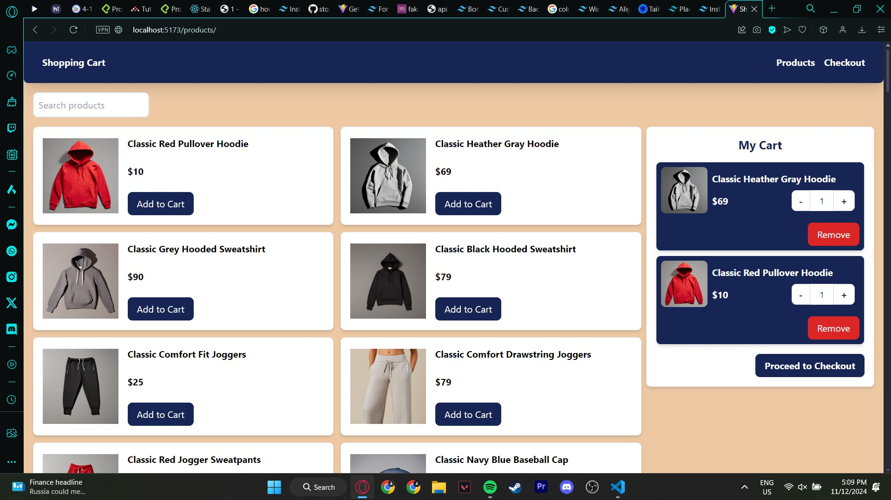
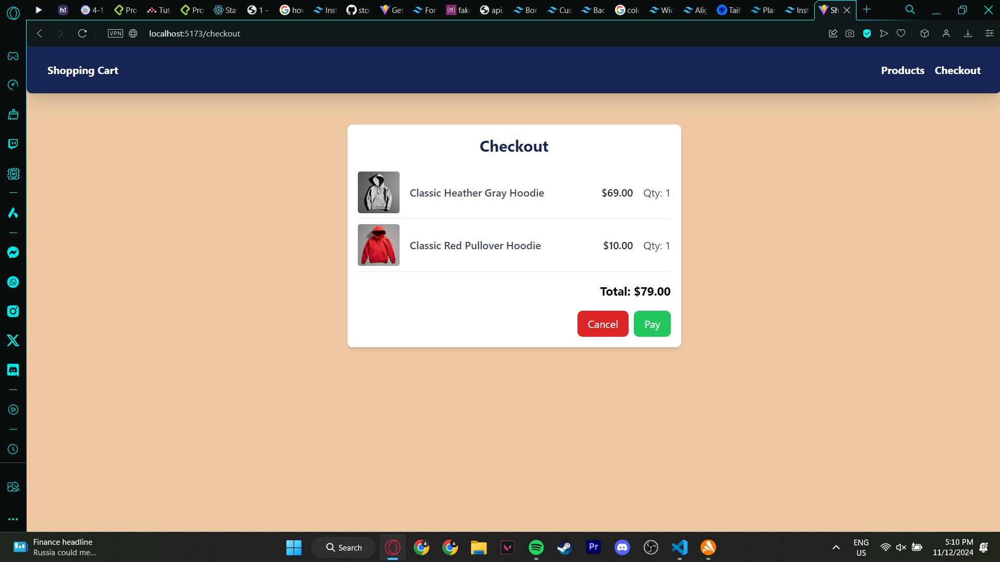

# SHOPPING CART

## DESCRIPTION
A simple e-shopping cart built with React + Vite, where users can add products to the cart, proceed to checkout, and view the total price and pay!

### STEPS TO RUN:
1. **Clone the Repository:**
    git clone https://github.com/mugikarl/shopping-cart.git
2. **Navigate to the Project Folder**
    cd shopping-cart
3. **Install Dependencies**
    npm install
    npm install react-router-dom
    npm install -D tailwindcss postcss autoprefixer

## LIBRARIES USED
├── react
│   ├── react-dom
│   └── react-router-dom
├── tailwindcss
│   ├── postcss
│   └── autoprefixer

## IMAGES OF THE SHOPPING CART

